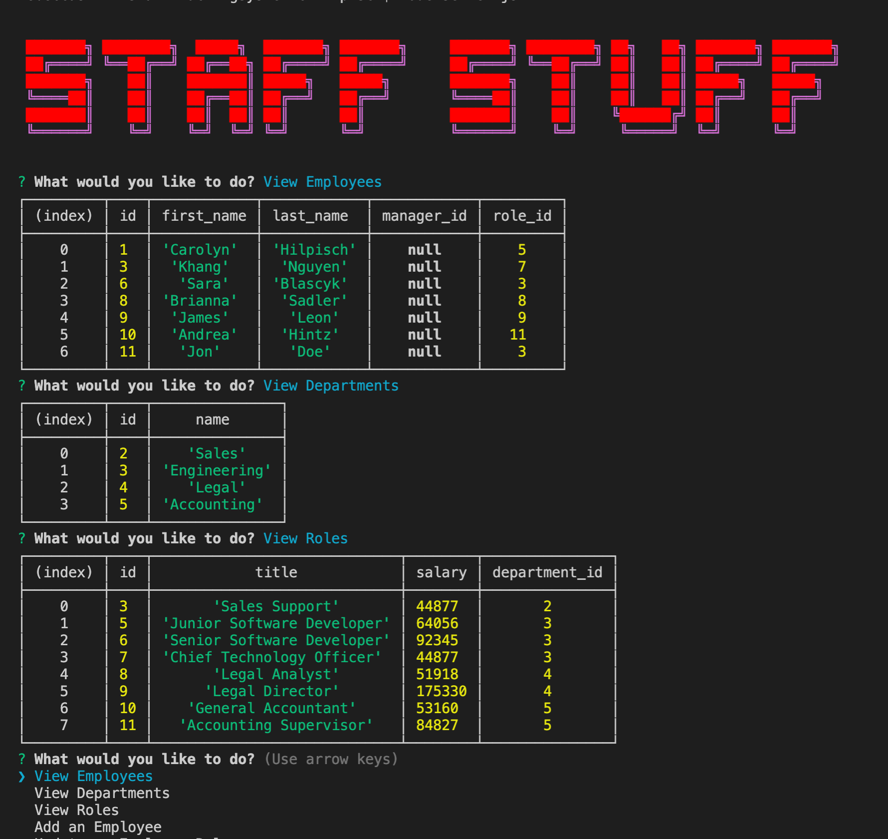

# Staff Tracker
## 


## Table of Contents:
<ol>
<li><a href="#description">Description</a></li>
<li><a href="#installation">Installation</a></li>
<li><a href="#usage">Usage</a></li>
<li><a href="#testing">Testing</a></li>
<li><a href="#contributing">Contributing</a></li>
<li><a href="#questions">Questions</a></li>
<li><a href="#license">License</a></li>
</ol>

## Description:
Tasked with creating an interface that make it easy for the user to view and interact with information stored in an employee database. I was challenged with architecting  and building a solution for managing a company's employees using node, inquirer, and MySQL.

## Installation :
The application can be run in the termianl inside of your chosen coding application. It uses Javascript and Node as the languages to access it. 
The user must make sure to use the following code so that the inquirer is available to them:
```bash
npm i
```
The application is invoked by using the following command:
```bash
node server.js
```

The application is also connected with a mySQL workbench, where there are three interrelated tables that are stored in an employee database.  The database is called employeetracker_db, with the tables called employee, role, and department.  

## Usage: 
The user will open the command terminal inside the chosen coding platform.  The user will then run node server.js inside the command line.   After running that code, the user is prompted with questions about the user's team members.  
The user has options to do the following things with the database: 
<ul> 
<li>View Employees</li>
<li>View Departments</li>
<li>View Roles</li>
<li>Add an Employee</li>
<li>Update an Employee Role</li>
<li>Remove an Employee</li>
<li>Add a Role</li>
<li>Remove a Role</li>
<li>Add a Department</li>
<li>Remove a Department</li>
<li>Update an Employee Manager</li>
<li>View Employees by Manager</li>
</ul>
<br>

### This is the launched terminal with some tables on it:


<br>
<br>

### Here is the app in action:


### Here is the Website Walk Through<a></a>

## Testing:
N/A

## Contributing

Pull requests are always welcome.  When contributing to this repository, please first discuss the change you wish to make via email or issue.  
After approval, please follow the "fork-and-pull" Git workflow.
<ol>
<li>Fork the repo on GitHub</li>
<li>Clone the project to your own machine</li>
<li>Commit changes to your own branch</li>
<li>Push your work back up to your fork</li>
<li>Submit a Pull request so that we can review your changes</li>
</ol>

## Questions :

If you have any questions, feel free to reach out to me.   My email is ckhilpisch@gmail.com.

## License :

MIT License
Informataion avaiable here: 
https://opensource.org/licenses/MIT